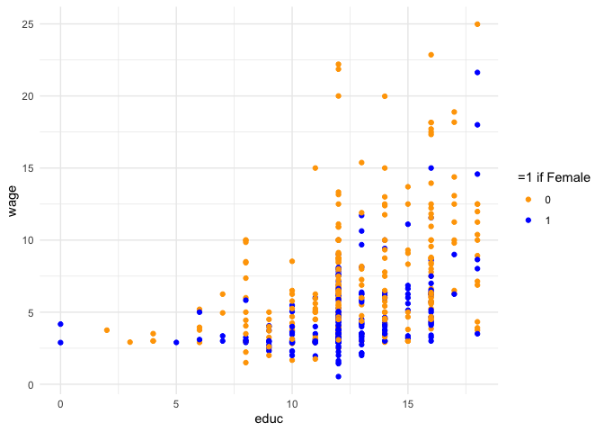

Test
================
2023-01-27

## First attempts

``` r
library(tidyverse)
library(wooldridge)
data(wage1)
```

``` r
ggplot(wage1, aes(educ, wage, color = as.factor(female))) + geom_point() + theme_minimal() +  scale_color_manual("=1 if Female",values=c("orange","blue"))
```

<!-- -->
